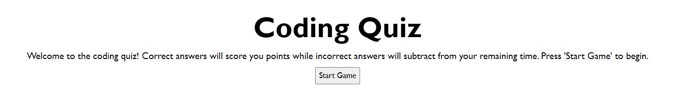
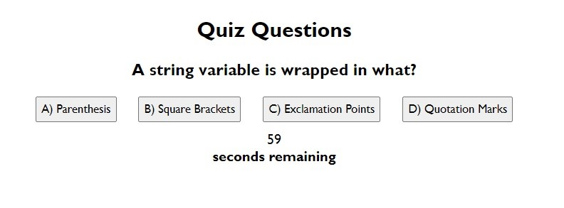
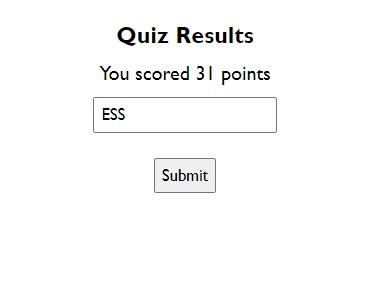
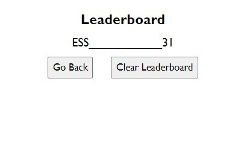

# coding-quiz

## Description
This program is a small quiz about JavaScript.

## Installation
N/A

## Usage
Press the start game button to begin the quiz. A question will be displayed with four buttons to press to choose your answer. The quiz will tell you if your chosen answer was correct or incorrect before moving on to the next question. Incorrect answers will subtract from the timer. After all questions have been answered, enter your initials to save your score on the leaderboard!

## Credits
Ethan Stone

## License
N/A